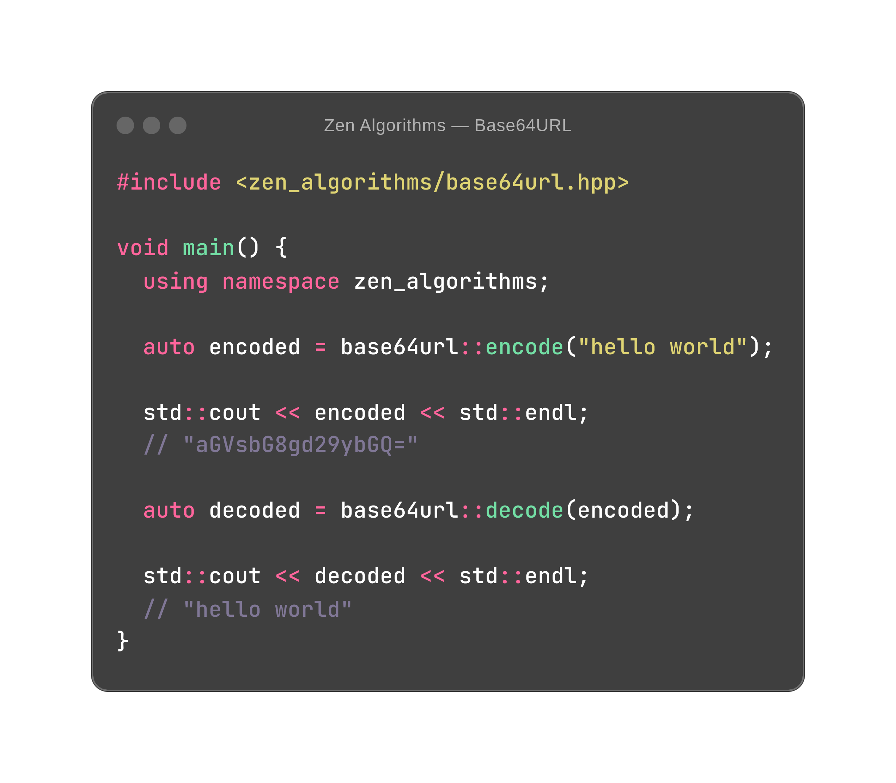

See more [examples](https://github.com/ZenAlgorithms/Base64URL/blob/master/tests/implementation_test.cc) ...

## Build

```shell
git clone https://github.com/ZenAlgorithms/Base64URL.git
cd Base64URL
mkdir build
cd build
cmake ..
make
make install
```